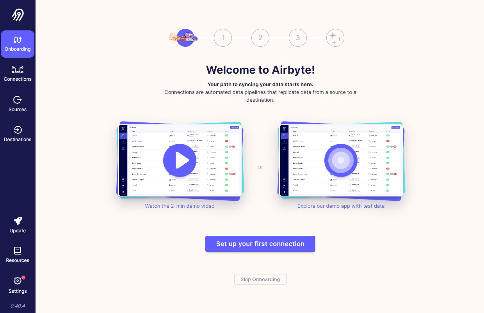

# Airbyte on Elestio with CI/CD

Example CI/CD pipeline showing how to deploy Airbyte on Elestio.

 

 

# Once deployed ...

You are now able to sign to the Airbyte Web UI here:
    
    https://[CI_CD_DOMAIN]/
    login: root (set in reverse proxy basic auth)
    password: [ADMIN_PASSWORD] (set in reverse proxy basic auth)

# QuickStart
https://github.com/airbytehq/airbyte/blob/master/docs/quickstart/getting-started.md

# Documentation
https://docs.airbyte.io/